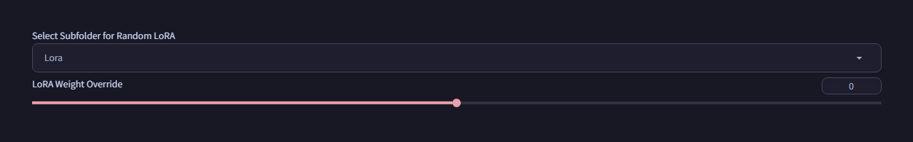

# SD Forge Random LoRA
This is an Extension for the Forge Webui, which randomly selects a LoRA from a specified folder every generation.

> Compatible with [Forge](https://github.com/lllyasviel/stable-diffusion-webui-forge), [reForge](https://github.com/Panchovix/stable-diffusion-webui-reForge), [Forge Classic](https://github.com/Haoming02/sd-webui-forge-classic)

<p align="center">

</p>

## Features

- Randomly selects a LoRA from a specified folder
- Injects the LoRA syntax along with its activation text  
- Allows custom weight override for LoRA 
- Displays debug information 

## Usage

1. On launch, this Extension will look for all subfolders in the LoRA folder and set up the Dropdown
2. Simply select a subfolder, then this Extension will add a random LoRA from the folder every generation, based on `Seed`
3. It will additionally look for the metadata `.json` file, and add the `activation text`, `preferred weight`, and `negative text` if possible
4. The weight of LoRA is determined in the following order:
    ```
    Weight Override -> Preferred Weight in Metadata -> Default Weight in Settings
    ```
